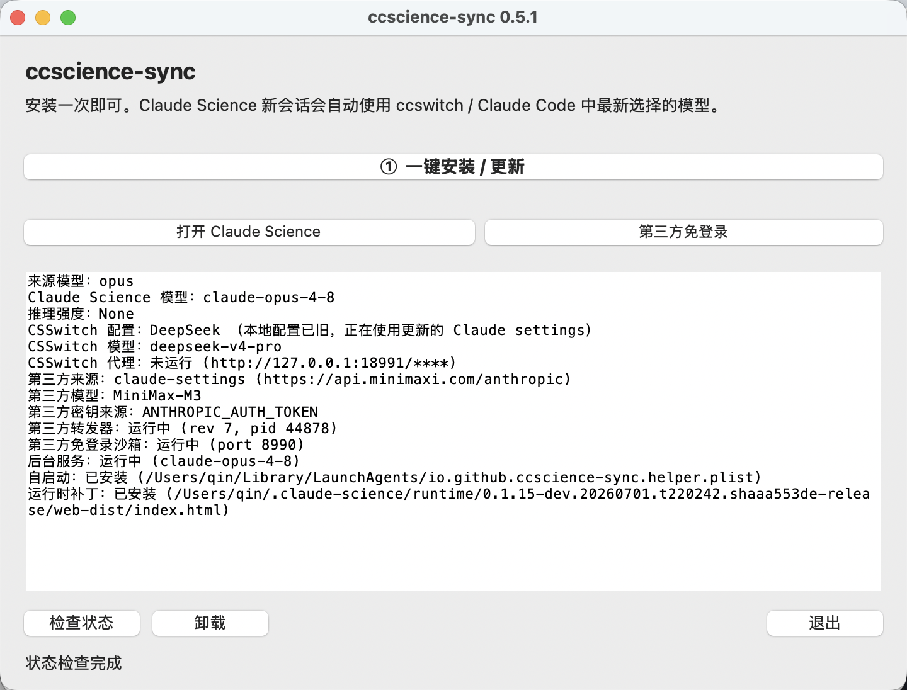
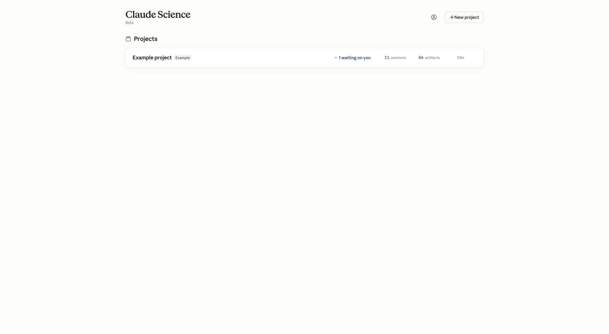
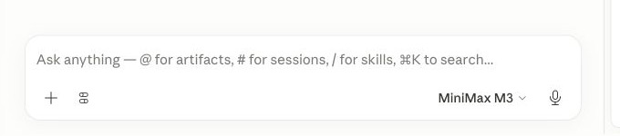

# ccscience-sync 快速使用说明

这份说明只讲最常用流程。先打开过一次 Claude Science，并在 CC.Switch 里选好模型。

## 1. 打开软件

macOS 打开 `ccscience-sync.app`，Windows 打开 `ccscience-sync.exe`。源码运行：

```sh
python3 ccscience_sync.py
```

主界面如下：



常用按钮：

- `① 一键安装 / 更新`：首次使用点一次；Claude Science 升级后再点一次。
- `打开 Claude Science`：有 Claude 账号时使用。
- `第三方免登录`：没有 Claude 账号、但有第三方 API 时使用。
- `检查状态`：确认服务和补丁是否正常。

## 2. 安装一次

点击 `① 一键安装 / 更新`，完成后点 `检查状态`。看到下面两项就可以用：

```text
后台服务：运行中
运行时补丁：已安装
```

以后在 CC.Switch 里切模型，不需要重新安装；新开一个 Claude Science 会话即可。

## 3. 有 Claude 账号

1. 在 CC.Switch 里切到目标模型。
2. 点击 `打开 Claude Science`。
3. 在 Claude Science 里新建会话。

如果页面要求登录，正常登录即可。链接会过期，过期后回到本软件重新点 `打开 Claude Science`。

## 4. 没有 Claude 账号

1. 在 CC.Switch 里选择第三方模型。
2. 点击 `第三方免登录`。
3. 浏览器会打开本地 Claude Science 页面。



这个页面使用隔离的本地沙箱，不会碰你的真实 Claude 登录态。请求会通过本机转发器发到你选择的第三方 API；密钥不会写进这个项目文档。

## 5. 开始对话

打开或新建项目，点击左侧 `New`。输入框底部会显示当前模型：



输入问题并发送。第一次使用工具时，如果页面弹出授权提示，只允许你信任的工具。

## 6. 常见问题

**模型没变**：旧会话会保留创建时的模型，请新建会话测试。

**页面打不开**：点 `检查状态`，确认后台服务、第三方转发器和免登录沙箱都在运行；旧链接过期时重新点入口按钮。

**找不到 runtime**：先手动打开一次 Claude Science，再点 `① 一键安装 / 更新`。

**出现 `Agent Failed` / `invalid params`**：确认使用最新版，重新点 `第三方免登录` 打开新页面，再新建会话测试。

**第三方模型不可用**：检查 CC.Switch 当前配置和对应 API key。只记录环境变量名，不要把密钥明文写进代码或文档。
